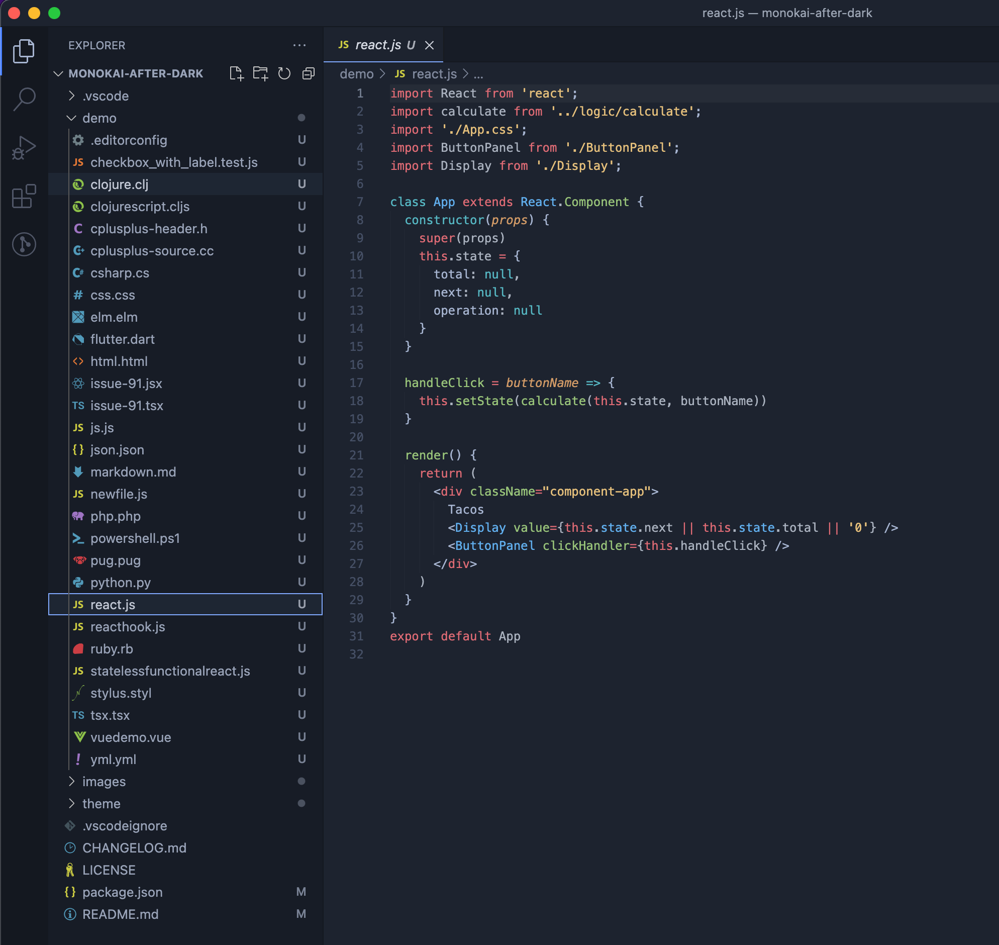
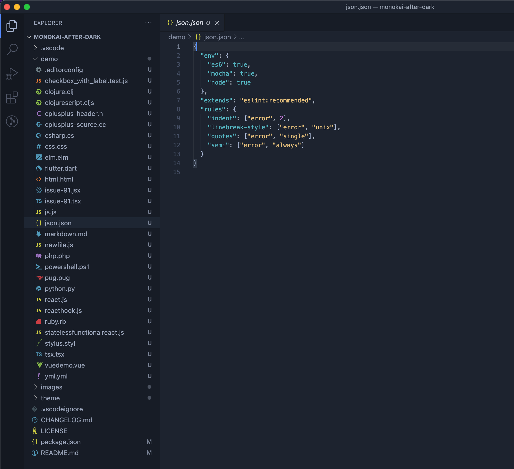

# Monokai After Dark Theme

Monokai After Dark theme for VS Code.

## Monokai After Dark

## Installation

1. Open **Extensions** sidebar panel in VS Code. `View → Extensions`
2. Search for `Monokai After Dark`
3. Click **Install** to install it.
4. Code > Preferences > Color Theme > **Monokai After Dark**

## Acknowledgements

This theme is based on the [One Monokai](https://marketplace.visualstudio.com/items?itemName=azemoh.one-monokai) theme from Joshua Azemoh. The `/demo` folder is based on the one in the [Night Owl](https://aka.ms/nightowl) theme by Sarah Drasner.

